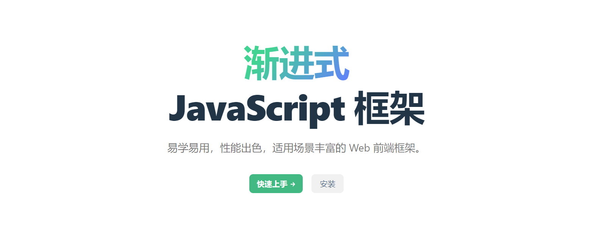

# Vue

Vue官网：https://cn.vuejs.org/guide/introduction.html



## Vue介绍

Vue (发音为 /vjuː/，类似 view) 是一款用于构建用户界面的 JavaScript 框架。它基于标准 HTML、CSS 和 JavaScript 构建，并提供了一套声明式的、组件化的编程模型，帮助你高效地开发用户界面。无论是简单还是复杂的界面，Vue 都可以胜任。

- Vue 是一个前端的框架，主要负责帮助我们构建用户的界面
- MVVM：Model - View - View Model
- Vue 负责 vm 的工作（视图模型），通过 Vue 可以将视图和模型相关联。
    - 当模型发生变化时，视图会自动更新
    - 也可以通过视图去操作模型
- Vue 思想：
    - 组件化开发
    - 声明式的编程

### Vue启动

```
yarn create vue
cd vue
yarn dev
```

可以在`package.json`中添加自动启动：`"dev": "vite --open"`

```js
{
    "name": "vue-project",
    "version": "0.0.0",
    "private": true,
    "scripts": {
        "dev": "vite --open",
        "build": "vite build",
        "preview": "vite preview"
    },
    "dependencies": {
        "vue": "^3.2.45"
    },
    "devDependencies": {
        "@vitejs/plugin-vue": "^3.2.0",
        "vite": "^3.2.4"
    }
}
```

### 直接在网页中使用

```html
<script>
    // 编写vue代码
    // 创建一个根组件，在vue3中组件就是一个普通的js对象
    // 组件用来创建组件实例，组件是组件实例的模板
    // 组件 --> 组件生成组件实例 --> 虚拟DOM --> DOM（在页面中呈现）
    const Root = {
        template: "<h1>我爱Vue</h1>" // 希望组件在页面中呈现的样子
    }

    // 创建app实例
    //const app = Vue.createApp(Root)
    // 将实例在页面中挂载
    //app.mount("#app")

    Vue.createApp(Root).mount("#app")
</script>
```

### 组件中的data

```html
<script>
    // 编写vue代码
    // 创建一个根组件，在vue3中组件就是一个普通的js对象
    // 组件用来创建组件实例，组件是组件实例的模板
    // 组件 --> 组件生成组件实例 --> 虚拟DOM --> DOM（在页面中呈现）
    const Root = {
        data() {
            return {
                message: "Vue好棒！" // data方法返回的对象，其中的属性会自动添加到组件实例中
            }
        }, // data是一个函数，需要一个对象作为返回值

        // 在模板中可以直接访问组件实例中的属性
        // 在模板中可以通过 {{属性名}} 来访问到组件实例中的属性
        template: "<h1>我爱Vue，{{message}}</h1>" // 希望组件在页面中呈现的样子
    }

    // 创建app实例
    //const app = Vue.createApp(Root)
    // 将实例在页面中挂载
    //app.mount("#app")

    Vue.createApp(Root).mount("#app")
</script>
```

### 按钮案例

- 如果直接将模板定义到网页中，此时模板必须符合html的规范
    - `My-Button -> my-button`

- 如果在组件中定义`template`，则会优先使用`template`作为模板，
    - 同时根元素中的所有内容，都会被替换
    - 如果在组件中没有定义`template`，则会使用根元素的`innerHTML`作为模板使用

- 组件是用来创建组件实例的`（vm）`
    - 创建一个按钮，可以显示按钮的点击的次数

- `template`是模板，它决定了组件最终的样子。定义模板的方式有三种：
- 1.在组件中通过`template`属性去指定
    
- 2.直接在网页的根元素中指定
    
- 3.组件中通过`render()`直接渲染

### 模板介绍

```html
<script>
    // 组件是用来创建组件实例的（vm）
    // 创建一个按钮，可以显示按钮的点击的次数

    const Root = {
        data() {
            return {
                count: 0 // 记录点击次数

                // data中的数据会自动和使用它的视图绑定，数据发生变化视图会自动刷新
            }
        },

        template:
            "<button @click='count++'>点我一下</button> - 点了{{count}}次"
    }

    Vue.createApp(Root).mount("#app")
</script>
```

## Vue基础

`App.vue`是根组件，`createApp(App)` 将根组件关联到应用上

- 会返回一个应用的实例
    - `app.mount("#app")` 将应用挂载到页面中
- 会返回一个根组件的实例，组件的实例通常可以命名为`vm`
- 组件实例是一个`Proxy`对象（代理对象）

- 直接向组件实例中添加的属性不会被`vue`所代理，不是响应数据，修改后页面不会发生变化

- `data`会返回一个对象作为返回值，`vue`会对该对象进行代理

---

### data

有些场景下，可以通过`shallowReactive()`来创建一个浅层的响应式对象

```js
return shallowReactive({
 msg: "大闸蟹今天没去玩游戏！",
 stu: {
     name: "孙悟空",
     age: 18,
     gender: "男",
     friend: {
         name: "猪八戒"
     }
 }
})
```

### methods

- `methods `用来指定实例对象中的方法 
    - 它是一个对象，可以在它里边定义多个方法
    - 这些方法最终将会被挂载到组件实例上
    - 可以直接通过组件实例来调用这些方法 
    - 所有组件实例上的属性都可以在模板中直接访问
    - `methods`中函数的this会被自动绑定为组件实例

```js
methods: {
    sum(a, b){
        // console.log(this) // 组件实例 vm
        return a + b
    },

    changeMsg(){
        this.msg = "新的消息！"
    }
}
```

### computed

- `computed` 用来指定计算属性

    ```
    {
        属性名:getter
    }
    ```

- 计算属性，只在其依赖的数据发生变化时才会重新执行

- 会对数据进行缓存

```js
computed: {
    info() {
        // 在计算属性的getter中，尽量只做读取相关的逻辑
        // 不要执行那些会产生（副）作用的代码
        console.log("---> , info调用了！")

        return this.stu.age >= 18
            ? "你是一个成年人！！！"
            : "你是一个未成年人！！！"
    },

    // 计算属性的简写（只有getter时）
    // name(){
    //     return this.lastName + this.firstName
    // }
    // 可以为计算属性设置setter，使得计算属性可写，但是不建议这么做
    name: {
        get() {
            return this.lastName + this.firstName
        },

        set(value) {
            // set在计算属性被修改时调用
            this.lastName = value[0]
            this.firstName = value.slice(1)
        }
    }
}
```

- 在计算属性的`getter`中，尽量只做读取相关的逻辑。不要执行那些会产生副作用的代码。

### 组合式api

- 在组合式`api`中直接声明的变量，就是一个普通的变量，不是响应式属性， 修改这些属性时，不会在视图中产生效果。
- 可以通过 `reactive()`来创建一个响应式的对象，需要先导入`reactive()`
- 在`setup()`中可以通过返回值来指定那些内容要暴露给外部，暴露后的内容，可以在模板中直接使用

`import { reactive } from "vue"`

```js
setup() {
    // 定义变量
    // 在组合式api中直接声明的变量，就是一个普通的变量，不是响应式属性
    //      修改这些属性时，不会在视图中产生效果
    let msg = "今天天气真不错!"
    let count = 0

    //可以通过 reactive()来创建一个响应式的对象
    const stu = reactive({
        name: "孙悟空",
        age: 18,
        gender: "男"
    })

    function changeAge(){
        stu.age = 44
    }

    // 在setup()中可以通过返回值来指定那些内容要暴露给外部
    // 暴露后的内容，可以在模板中直接使用
    return {
        msg,
        count,
        stu,
        changeAge
    }
}
```

- 也可以在`script`标签上加`setup`，快速使用

```js
<script setup>
import { reactive } from "vue"

const msg = "我爱Vue"
const count = 0
const stu = reactive({
    name: "孙悟空"
})

function fn() {
    alert("哈哈哈，好快乐！")
}
</script>
<template>
    <h1 @click="fn">组合式的API</h1>
    <h2>{{ msg }} -- {{ count }}</h2>
    <h3>{{ stu.name }}</h3>
</template>
```

### 响应式对象

#### reactive()

- 返回一个对象的响应式代理， 是一个深层响应式对象
- 也可以使用`shallowReactive()`创建一个浅层响应式对象，缺点：只能返回对象的响应式代理！不能处理原始值

#### ref()

- 接收一个任意值，并返回它的响应式代理

- `ref`在生成响应式代理时，它是将值包装为了一个对象 `0  --> {value:0}`
- 访问`script`标签中范围访问`ref`对象时，必须通过 对象`.value `来访问其中的值；在模板中，`ref`对象会被自动解包。
- `ref`对象在模板中可以自动解包（要求`ref`对象必须是顶层对象）

## 模板（template）

- 在模板(`template`标签)中，可以直接访问到组件中声明的变量

- 除了组件中的变量外，`vue`也为我们提供了一些全局对象可以访问：
    - 比如：`Date`、`Math`、`RegExp `...
    - 除此之外，也可以通过`app`对象来向`vue`中添加一些全局变量， `app.config.globalProperties`

- 使用插值(双大括号)，只能使用表达式。表达式，就是有返回值的语句
- 插值实际上就是在修改元素的`textContent`，如果内容中含有标签，标签会被转义显示，不会作为标签生效。
- 指令：
    - 指令模板中为标签设置的一些特殊属性，它可以用来设置标签如何显示内容。
    - `v-text` 将表达式的值作为元素的`textContent`插入，作用同`{{}}`使用指令时，不需要通过`{{}}`来指定表达式。
    - `v-html `将表达式的值作为元素的`innerHTML`插入，有`xss`攻击的风险。

### v-bind指令

- 当我们需要为标签动态的设置属性时，需要使用v-bind指令,
- `v-bind`可以简写为` :`
- 当我们为一个布尔值设置属性时
    - 如果值为`true`，则元素上有该属性（转换后为`true`，也算`true`）
    - 如果值为`false`，则元素没有该属性（转换后为`false`，也算`false`）
    - 特殊情况：`"" `空串，在这里会被当成真值

### style scoped

- 可以为`style`标签添加一个`scoped`属性，该样式将成为局部样式，只对当前组件生效。
- 实现原理：当我们在组件中使用`scoped`样式时，Vue会自动为组件中的所有元素生成一个随机的属性，形如：`data-v-7a7a37b1`，生成后，所有的选择器都会在最后添加一个`[data-v-7a7a37b1]`,例如h1标签样式会变成`h1[data-v-7a7a37b1]`，`.box1`样式会变为`.box1[data-v-7a7a37b1]`
- 注意：随机生成的属性，除了会添加到当前组件内的所有元素上，也会添加到当前组件引入的其他组件的根元素上，这样设计是为了可以通过父组件来为子组件设置一些样式

### css module

- 自动的对模块中的类名进行hash化来确保类名的唯一性

- 在模板中可以通过 $style.类名 使用

- 也可以通过module的属性值来指定变量名

## 属性

### props

- 父组件可以通过props来向子组件传递数据
    - 注意：父组件传递给子组件的props都是只读的，无法修改

- 即使可以修改，我们也尽量不要在子组件中去修改父组件的数据。如果非得要改，具体方法后边再讲（自定义事件）

- 属性名
    - 定义属性名时，属性名要遵循驼峰命名法

```js
const props = defineProps(["count", "obj", "maxLength"])
```

### v-if 和 v-show

- v-show 可以根据值来决定元素是否显示（通过display来切换元素的显示状态）
- v-if 可以根据表达式的值来决定是否显示元素（会直接将元素删除）
- v-show通过css来切换组件的显示与否，切换时不会涉及到组件的重新渲染
    - 切换的性能比较高。
    - 但是初始化时，需要对所有组件进行初始化（即使组件暂时不显示）。所以它的初始化的性能要差一些！
- v-if通过删除添加元素的方式来切换元素的显示，切换时反复的渲染组件，切换的性能比较差。
    - v-if只会初始化需要用到的组件，所以它的初始化性能比较好
    - v-if可以和 v-else-if 和 v-else结合使用
    - v-if可以配合template使用

```html
<div v-if="isShow">
    <h2>我是if中的内容</h2>
</div>
<div v-else>
    <h2>我是else中的内容！</h2>
</div>
```

### component 动态组件

- component 是一个动态组件
    - component最终以什么标签呈现由is属性决定

```js
<script setup>
    import {ref} from "vue";

    const isShow = ref(true)
</script>

<template>
    <component :is="isShow? A: B">我是component</component>
</template>
```

### v-for 指令

- `v-for`：可完成对可迭代对象的遍历
- 在使用`v-for`时，可以为元素指定一个唯一的`key`，有了`key`以后，元素再比较时就会按照相同的`key`去比较而不是顺序。

```html
<template>
    <ul>
        <li v-for="name in arr">{{ name }}</li>
    </ul>
</template>
```

### slot 插槽

- 通过插槽`（slot）`在父组件中指定子组件中的内容。
- 通过插槽引入组件，位于父组件的作用域中。
- 直接写在组件中内容是默认插槽的内容，只会出现在默认插槽中。

```js
<MyButton>插槽的入口</MyButton>

<button>
    <slot></slot>  插槽的出口
</button>

// 通过插槽引入组件，位于父组件的作用域中

<MyButton>
	<A :name="name"></A>
</MyButton>
```

### event事件

- 为元素绑定事件：
    - 绑定事件使用`v-on`指令，`v-on:事件名`；`@事件名`

- 绑定事件的两种方式
    - 内联事件处理器（自己调用函数）：事件触发时，直接执行js语句。
    - 内联事件处理器，回调函数的参数由我们自己传递
- 方法事件处理器（vue帮我们调用函数）
    - 事件触发时，vue会对事件的函数进行调用
    - 方法事件处理器，回调函数的参数由vue帮我们传，参数就是事件对象

- Vue如何区分两种处理器：
    -  检查事件的值是否是合法的js标识符或属性访问路径，如果是，则表示它是方法事件事件处理器，否则，表示它是内联事件处理器。

```
foo（方法）
foo.bar（方法）

foo++（内联）
foo()（内联）
```

- 内联事件处理器

    - 内联事件处理器，回调函数由我们自己调用，参数也是我们自己传递的

    - 在内联事件处理器中，可以使用`$event`来访问事件对象

- 事件修饰符：

    - `.stop `停止事件的传播？似乎`stop`只能停止冒泡

    - `.capture `在捕获阶段触发事件

    - `.prevent` 取消默认行为

    - `.self` 只有事件由自身触发时才会有效

    - `.once` 绑定一个一次性的事件

    - `.passive` 主要用于提升滚动事件的性能

### 透传属性

- 在组件上设置属性，会自动传递给组件的根元素，这样一来可以方便我们在父组件中为子组件来设置属性。
- 透传会发生在没有被声明为`props`和`emit`的属性上。
- 自动的透传只适用单根组件。
- 在`script`中，可以通过`useAttrs()`来获取透传过来的属性。

```js
import {useAttrs} from "vue";
const attrs = useAttrs();
```

- 在模板中，可以通过`$attrs`来访问透传过来的属性，可以手动指定透传过来的属性要添加到哪些元素。

## 表单

### 双向数据绑定

将表单项的value属性和变量text进行绑定。

- 单向绑定：当value发生变化时，text变量会随之变化。
- 双向绑定：当value或text任意一个发生变化，另一个也会随之变化。

```js
import { ref } from "vue"
let text = ref("")
```

```html
<div>
    <input
        type="text"
        @input="(event) => (text = event.target.value)"
        :value="text"
    />
</div>
```

### v-model

- vue为我们提供了v-model了可以快速完成表单的双向数据绑定

```html
<input type="text" v-model="text"/>
<input type="text" :value="text" @input="event => text = event.target.value"/>
```

### v-model 修饰符

- `.lazy`：使用change来处理数据
- `.trim`：去除前后的空格
- `.number`：将数据转换为数值

```html
<div>
    信息：
    <input type="text" v-model.lazy.trim.number="text" />
</div>
```

### 依赖注入

- 通过依赖注入，可以跨域多层组件向其他的组件传递数据。
- 步骤：
    1. 设置依赖（provide） provide(name, value)
    2. 注入数据 （inject） const value = inject(name, default)

## 状态管理

### Pinia

- 安装Pinia

```
yarn add pinia
# 或者使用 npm
npm install pinia
```

- quick start
    - 在`main.js`中引入`createPinia()`
    - 通过`createPinia()`创建`pinia`实例
    - 将`pinia`配置为Vue的插件

```js
const pinia = createPinia()
const app = createApp(App)
app.use(pinia)
app.mount('#app')
```

### store

- 通过函数来创建store
- 定义形式：`defineStore("store的id", 配置对象)`
- 配置对象：`state`是一个函数，将需要由`pinia`维护的数据以对象的形式返回

- `store`实例本身就是一个`reactive`对象，可以通过它直接访问`state`中的数据，但是如果直接将`state`中数据解构出来，那么数据将会丧失响应性
- 可以通过`storeToRefs()`来对`store`进行解构，
- 它可以将`state`和`getters`中的属性解构为`ref`属性，从而保留其响应性

### state 修改

- 直接修改

- 通过`$patch`

- 通过`$patch`传函数的形式的修改

- 直接替换`state`

- 重置`state`

```js
stuStore.$patch((state) => {
    state.skills.push("救命毫毛")
})

stuStore.skills.push("哈哈")

stuStore.$patch({ name: "孙小圣" })
stuStore.$state = { name: "孙小圣" }
```

### 订阅

- 当`store`中的`state`发生变化时，做一些响应的操作。
- 使用方式：`store.$subscribe(函数, 配置对象)`
- 使用订阅时不要在回调函数中直接修改state。

### action

- `$onAction`用来订阅`action`的调用
- 参数：
    - `name`：调用的`action`的名字
    - `store`：`store`的实例
    - `args`：`action`接收到的参数
    - `after()`：可以设置一个回调函数，函数会在`action`成功调用后触发
    - `onError()`：可以设置一个回调函数，函数会在`action`调用失败后触发


