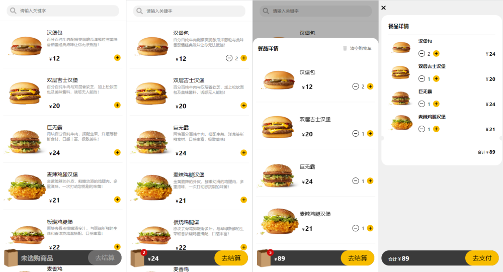

# 汉堡包APP

代码详情参考`09-meals`

## 案例展示

- 开发示例图



---

- 项目结构图


## 开发详情

在开发过程中，需要注意数据与页之间最好不要发生耦合，数据统一由`pinia`中的函数处理。

组件也要分门别类，组件要有复用性，比如`Mask`遮罩组件，在很多地方都使用到了它，那就必须设置为通用组件。

相关代码可以在`09-meals`中找到这里只说明一些`pinia`中的函数

- getters

```js
// 根据关键字过滤汉堡
filterMeals: state => {
    return state.data.filter(item => item.title.indexOf(state.keyword) != -1)
},

// 获取购物车中的所有商品
cartMeals: state => {
    return state.data.filter((item) => item.count > 0)
},
// 获取购物车中商品总数量
totalCount: state => {
    // 如果购物车中没有商品直接返回0
    if (state.cartMeals.length <= 0) return 0
    // 购物车中有商品
    return state.cartMeals.reduce((result, item) => result + item.count, 0)
},
// 获取购物车中的商品总价格
amount: state => {
    // 如果购物车中没有商品直接返回0
    if (state.cartMeals.length <= 0) return 0
    // 购物车中有商品
    return state.cartMeals.reduce((result, item) => result + item.count * item.price, 0)
}
```

- action

```js
addMealToCart(meal) {
    // 修改购买食物的数量
    // meal还没有添加到购物车
    if (isNaN(meal.count)) {
        meal.count = 0
    }

    meal.count++
},
subMealFormCart(meal) {
    // 修改购买食物的数量
    // meal还没有添加到购物车
    if (isNaN(meal.count) || meal.count <= 0) return
    meal.count--
},
// 清空购物车
clearCart() {
    this.cartMeals.forEach(item => item.count = 0)
}
```

09-meals：Total
编辑器使用时间：3.3 小时
活跃编程时间：2.0 小时
添加的代码行数：2,139
删除的代码行数：287
总的键入数：9,983

## 总结

因为之前没怎么接触过`js`，对`JavaScript`的一些函数不是很熟悉。比如箭头函数，看完了这个课程才明白原来是这么用的。也许过一段时间再来看自己写的代码，也会觉得傻得可爱。

那关于`Vue`的学习就要告一段落了，接下来是`flask`，再然后是`Vue + Falsk + Cesium`。顺利的话，大约会在2023年年末完成叭，祝好运~